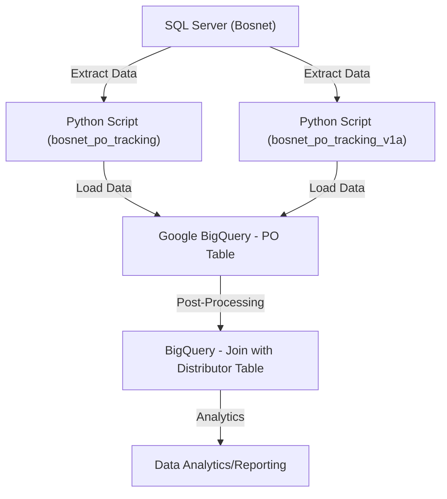
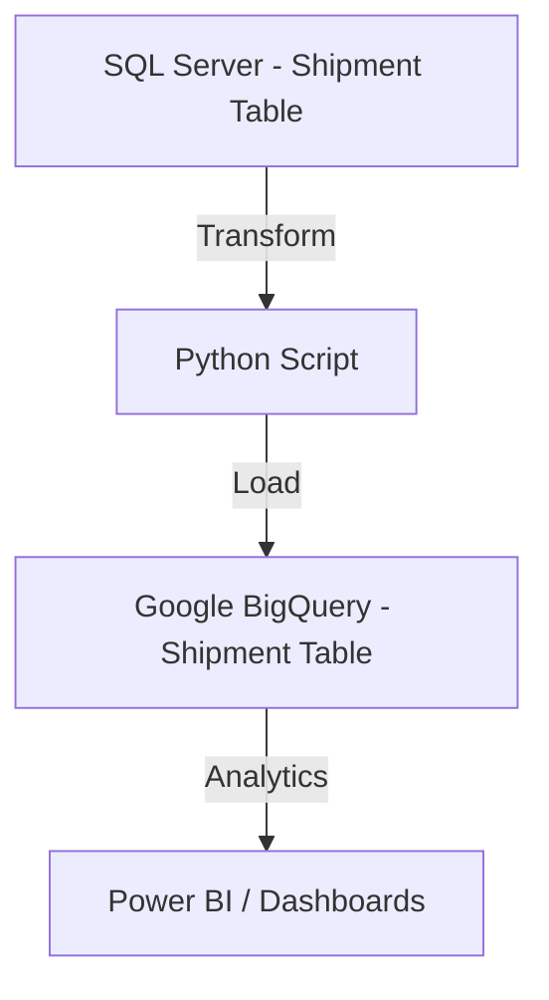
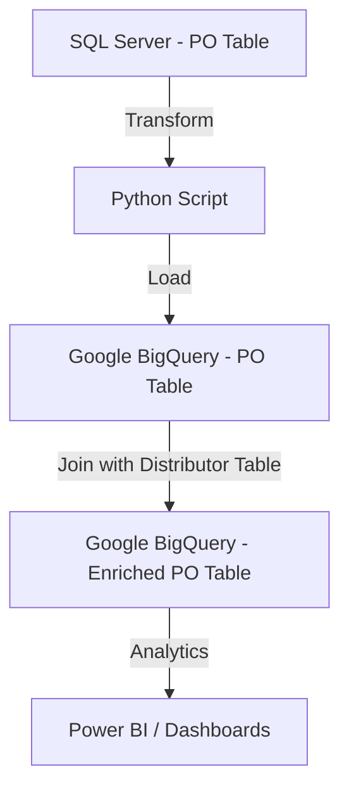

# Sell-In Data Flow

This repository contains Python scripts and SQL queries for managing and migrating **Sell-In Data** between SQL Server (Bosnet) and Google BigQuery. Below is a detailed explanation of the workflow, logic, and data lineage.

---

## **1. Sell-In Data Flow Overview**

### **Python Scripts**

#### **1.1. bosnet\_po\_tracking**

This script fetches Purchase Order (PO) data for Month-To-Date (MTD) from Bosnet (SQL Server) and uploads it to Google BigQuery.

**Logic:**

- **PO Date:** Month-To-Date (MTD)
- **Channel:** `GT`, `MTI`
- **Status:** Exclude `Rejected`, `Canceled`
- **PO Number:** Exclude entries with `RES`

---

#### **1.2. bosnet\_po\_tracking\_v1a**

This script fetches PO data for the last three months (including MTD) from Bosnet (SQL Server) and uploads it to Google BigQuery.

**Logic:**

- **PO Date:** Last 3 Months (including MTD)
- **Channel:** `GT`, `MTI`
- **Status:** Exclude `Rejected`, `Canceled`

---

## **2. SI Data Migration Flow**

This process is executed **after month closing** to ensure accurate migration of Sell-In data.

### **Flow Diagram**



---

## **3. Data Lineage on Data Warehouse**

### **3.1. Shipment Data**



### **3.2. Purchase Order (PO) Data**



---

## **4. Repository Structure**

```
.
├── python_scripts/
│   ├── bosnet_po_tracking.py
│   └── bosnet_po_tracking_v1a.py
├── sql_queries/
│   ├── sql_server_to_dw.sql
│   └── dw_post_processing.sql
├── README.md
└── assets/
    ├── sell_in_flow.png
    └── data_lineage.png
```

---

## **5. How **

### Prerequisites

- Python 3.x
- Required Python libraries (listed in `requirements.txt`)
- Access to SQL Server (Bosnet)
- Google Cloud SDK configured with access to BigQuery

### Steps

1. Clone the repository:
   ```bash
   git clone <repository-url>
   ```
2. Install dependencies:
   ```bash
   pip install -r requirements.txt
   ```
3. Update connection details in the Python scripts:
   - SQL Server credentials
   - Google BigQuery credentials
4. Run the appropriate script to extract and upload data:
   ```bash
   python python_scripts/bosnet_po_tracking.py
   ```
5. In Google BigQuery, run the provided SQL queries to join the PO data with the distributor table and perform any additional transformations.
6. Verify data and generate analytics using your preferred BI tool (e.g., Power BI).

---

## **6. Key Diagrams**

### Sell-In Data Flow


### Data Lineage (Shipment)


---

## **7. License**

This project is licensed under the MIT License. See `LICENSE` for more details.

---

## **8. Contact**

For any questions or feedback, please reach out to the repository maintainer.

